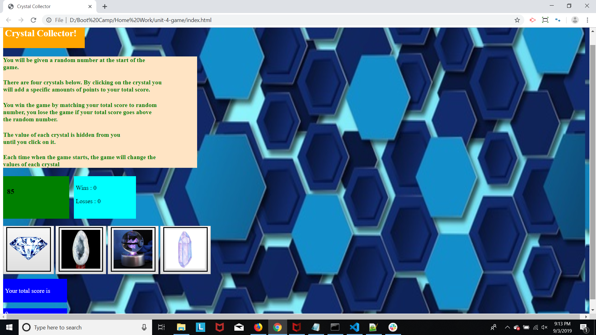

# Crystal Collector

## Site pictures


## Technologies Used
- HTML : used to create elements on the DOM
- Bootstrap  : Styles html elements on page
- Javascript : used to provide interative effects
- JQuery : event handling, DOM manipulation
- Git : version control system to track changes to source code
- GitHub : hosts repository that can be deployed to GitHub pages

## Summary
### A Game that collects crystals specified by computer. Player wins if specified number of crystals are collected. Player looses if collected crystals are greater than the specified number.

## Code Snippet
```Javascript

function game(){
$("#img1").on("click", function(){
    // var crystal1 = Math.floor(Math.random() * (12 - 1 + 1) + 1);
    console.log("Crystal 1: "+startGame.crystal1);
    score = score + startGame.crystal1;
    // score = score + $(this).val();
    console.log("Score 1: "+score);   
    populateScore();
});
```


## Author Links
[LinkedIn](https://www.linkedin.com/in/mahisha-gunasekaran-0a780a88/)

[GitHub](https://github.com/Mahi-Mani)

